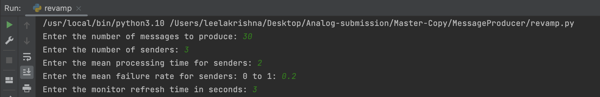
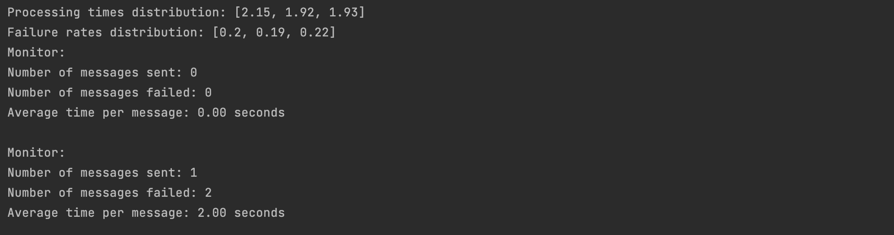

# SMS-Delivery-System

---
layout: page
title: SMS Emergency Message Delivery System
# permalink: /tutorials/week4-react-basics
# parent: Tutorials
# nav_order: 1
---

# SMS Messaging System Components
Message Delivery system comprises of monitor, producer, senders who are responsible for duties such as display the progress of messages and status, to produce the messages on to the synchronised queue and distribute to the senders, consume the message from the queue and process the message correspondingly.   

MVC (model, view, controller) architecture is being followed, where the monitor is acted as the view of the application. Producer, Sender together comprise controller and model of the system.

<!-- -   [React Basics](#react-basics) -->
-   [Required Frameworks](#Frameworks)
-   [Producer Class](#producer)
-   [Sender Class](#sender)
-   [Progress Monitor Class](#progress-monitor)
-   [Running application](#running-application)
    -   [Input](#input)
    -   [Output](#output)
-   [Source Files](#source-files)
-   [Test Suite](#test-suite)
    - [Monitor Testing](#monitor-testing)
    - [Sender Testing](#sender-testing)
    - [Producer Testing](#producer-testing)
    - [Fuzzy Testing](#fuzzy-testing)

## Frameworks

Python is expected to be installed on the machine inorder to execute the application.   

**unittest** python package for unit testing components.

## Producer

Producer class initialises the messages as a centralized queue, which could be accessed by multiple senders. 

**Source File**     -> **Revamp.py** - Producer Class

-   Producer is responsible for the message queue setup and synchronizing the queue between multiple senders.

**Test File**   -> **test/Producer-test.py** - Producer Test Class

-   This is the test file for the producer class, and a queue with various message length scenarios has been verified. 

## Sender

Sender class holds a reference to the message queue generated by the Producer, multiple sender instances are operated concurrently as separate threads.

**Source File**     -> **Revamp.py** - Sender Class

-   Producer is responsible for the message queue setup and synchronizing the queue between multiple senders. Each sender will be constructed with a specific processing time and failure rate, these values are distributed over the configurable mean, normal distribution. These mean values are provided to the system as input while starting the application.

**Test File**   -> **test/Sender-test.py** - Sender Test Class

-   This is the test file for the sender class, testing senders sent messages count and failure rate.

## Progress Monitor


Monitor class acts as the view to the system, where the current status of the application is displayed. The display values will be refreshed after every "n" seconds, which will be taken from user as input while starting the application.

**Source File**     -> **Revamp.py** - **Progress Monitor Class**

-   Monitor displays the values of no of messages sent successfully, failed messages and average time per message in seconds.

**Test File**   -> **test/Monitor-test.py** - **Monitor Test Class**

-   This is the test file for monitor, testing includes the refresh rate display and exiting monitor after all messages are processed by all senders.

## Running Application
To start the application please run the **revamp.py** file.  
It can be started on terminal with command 

```
python revamp.py
```

Upon initiating the application, the user is required to input several parameters necessary for the system's startup. These parameters are outlined in the input section. The system's output, namely the user interface, is presented through the execution terminal. All output logs are displayed and can be read directly from the terminal.

### Input
No of messages (n)  
No of senders (ns)  
Mean of processing times of senders (U processing)  
Mean of failure rate of senders (U failure)  
Refresh rate of monitor (r)  


### Output
Displays senders distribution values of processing times and failure rates  

The monitor after refreshing time, displays the latest status values such as   

No of messages sent so far (n)  
No of messages failed so far (nf)  
Average message time (Tn)


## Test Suite
### Monitor testing 
- monitor-test.py
### Sender testing
- sender-test.py
### Producer testing
- producer-test.py
### Fuzzy Testing
- fuzzy-test.py  

Contains the scenario of starting the system with 2000 messages, 3 senders, 1s processing mean time, 0 failure rate.  

## Source Files
- revamp.py
